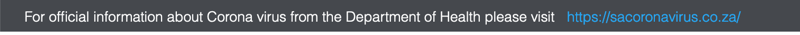
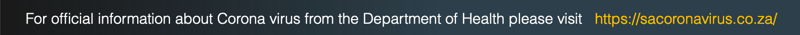
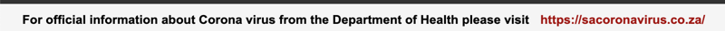

za-covid19-js
=============

za-covid19-js is a free solution for implementing a link to the www.sacoronvirus.co.za website, as legislated by the Minister of Communications and Digital Technologies.

This solution is based entirely on the [cookieBAR](https://cookie-bar.eu/) code.  CookieBAR is licensed under GNU General Public License v2.0, and as such, so is this code.

### Background

On the 26th of March 2020, the Minister of Communications and Digital Technologies published the [Disaster Management Act: Electronic Communications, Postal and Broadcasting Directions](https://www.gov.za/documents/disaster-management-act-electronic-communications-postal-and-broadcasting-directions-26) that directed

> All Internet sites operating within .zaDNA top level domain name must have a landing page with a visible link to www.sacoronavirus.co.za

The full text PDF of the gazette is available [here](https://www.gov.za/sites/default/files/gcis_document/202003/43164gon-417.pdf)

### Usage and configuration

Simply add this code to you page:

``

You can add optional URL parameters to control some elements of the bar:

`forceLang` will force the bar to use the language you specify.  Currently only `en` is supported, more to follow.

`top=1` will make the bar appear at the top of the page as a header.  Default is a footer.

`theme` controls how it looks.  Choose one of `altblack`, `grey`, `momh` or `white`.  Default (no theme specified) is black.

